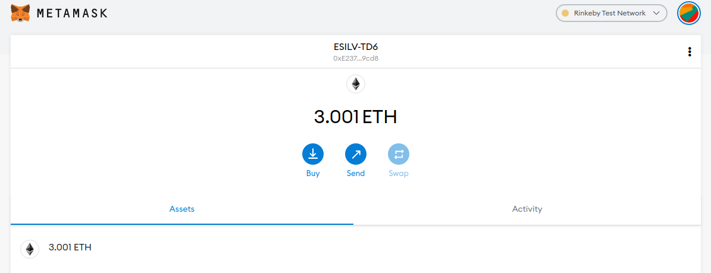
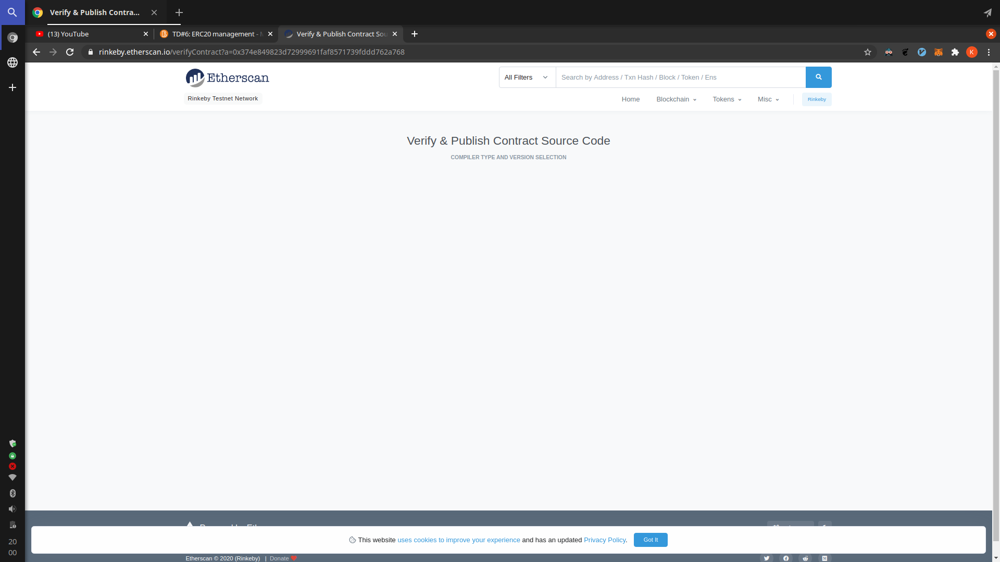

## Practical Work 6

The objectives of this PW is to write smart contracts that interact with the smart contract given by the teacher that is deployed on Rinkeby. To do so, we will use [truffle](https://www.trufflesuite.com/) and [Infura](https://infura.io/).

Here are the instructions:

- Create an Infura account and API Key (2 pts)
- Install and configure truffle (2 pts)
- Manually claim tokens on teacher ERC20 (2 pts)
- Create a contract (DepositorContract) that can claim tokens from teacher ERC20. Keep track of addresses who claimed token, and how much in DepositorContract (2 pts)
- Use approve() function to allow your contract to manipulate your tokens (1 pts) and revoke this authorization (1 pts)
- Create a function in DepositorContract to transfer tokens from the DepositorContract to the address that claimed them (2 pts)
- Create a function to deposit tokens in DepositorContract using transferFrom on teacher ERC20 (2 pts)
- Create and deploy an ERC20 (DepositorToken)to track user deposit. This ERC20 should be mintable and mint autorization given to DepositorContract (2 pts)
- Update the deposit function so that user balance is tokenized. When a deposit is made in DepositorContract, tokens are minted in DepositorToken and transfered to the address depositing. The deposit can be claimed by sending DepositorToken back to DepositorContract, who then burns them (2 pts)
- Publish the code of at least one of your deployed contracts on Etherscan using the "Verify and publish" functionnality (2 pts)

Teacher's smart contract address we have to interact with `0x58e9b79f804ebd4a3109068e1be414d0baac18ec`.

### Rinkeby Account

Before going further, since the smart contract is deployed on rinkeby we will need a rinkeby account. We can use [Metamask](https://metamask.io/) to create the account. Open it, select `Rinkeby Test Network` and copy the public key. Then go a rinkeby faucet like this [one](https://faucet.rinkeby.io/) and claim some testnet ethers.

You should end up with something like this:

<div style="display: flex; justify-content: center; align-items: center; margin: 30px 0">
  
</div>

### Infura

> Instruction: Create an Infura account and API Key

Login, select _Ethereum_ on the sidebar then create a project. On the _Keys_ section, select `Rinkeby` and the url that looks like `https://rinkeby.infura.io/v3/<project_id>` is the url we will use.

### Truffle

> Instruction: Install and configure truffle (2 pts)

Teacher's smart contract

```javascript
pragma solidity ^0.6.0;

import "@openzeppelin/contracts/token/ERC20/ERC20.sol";

contract ERC20TD is ERC20 {
    constructor(uint256 initialSupply) public ERC20("TD-ERC20", "TDE") {
        _mint(msg.sender, initialSupply);
    }

    function claimTokens() public {
        _mint(msg.sender, 1000);
    }
}
```

We notice that it uses the solidity compiler v0.6.0 and [Openzeppelin](https://github.com/OpenZeppelin/openzeppelin-contracts). In our case we will use a slightly more newer version of the solidity compiler because when compiling contracts truffle throws an error due to some contracts like `Address.sol` that are using v0.6.2

Create Truffle project

```bash
$ yarn init -y
$ yarn add truffle @openzeppelin/contracts solc@0.6.2 @truffle/hdwallet-provider
$ ./node_modules/.bin/truffle init
```

To be able to play on Rinkeby, we need provide to truffle some information like the `account` to use to send transactions and our `infura endpoint`.

```javascript
// truffle-config.js
const HDWalletProvider = require('@truffle/hdwallet-provider');

// take the one we created with metamask
const private_key = ...
const infura_endpoint = ...

module.exports = {
  networks: {
    rinkeby: {
      provider: () => new HDWalletProvider(private_key, infura_endpoint),
      network_id: 4,
      gas: 5500000,
    },
  },
  compilers: {
    solc: {
      version: '0.6.2',
    },
  },
};
```

To call truffle we need to do `./node_modules/.bin/truffle`. It's kinda boring so instead we can add scripts to the `package.json`.

```json
{
  "name": "smart-contracts",
  "version": "1.0.0",
  "license": "MIT",
  "scripts": {
    "compile": "truffle compile",
    "develop": "truffle develop",
    "console": "truffle console --network rinkeby"
  },
  "dependencies": {
    "@openzeppelin/contracts": "^3.2.0",
    "@truffle/hdwallet-provider": "^1.2.0",
    "dotenv": "^8.2.0",
    "solc": "0.6.2",
    "truffle": "^5.1.54"
  }
}
```

Then we can connect to `Rinkeby` and interact with teacher's smart contract. We need the `abi` and his `address`. The address is `0x58e9b79f804ebd4a3109068e1be414d0baac18ec`.

To get the `abi` we can copy/paste the contrat on [Remix](https://remix.ethereum.org/) and compile it. Or we can use truffle.

```javascript
// contracts/ERC20TD.sol
pragma solidity ^0.6.0;

import "@openzeppelin/contracts/token/ERC20/ERC20.sol";

contract ERC20TD is ERC20 {
    constructor(uint256 initialSupply) public ERC20("TD-ERC20", "TDE") {
        _mint(msg.sender, initialSupply);
    }

    function claimTokens() public {
        _mint(msg.sender, 1000);
    }
}
```

Compile it and in `./build/contracts/ERC20TD.json` we can get the `abi`.

```bash
$ yarn compile
```

### Claim tokens!

> Instruction: Manually claim tokens on teacher ERC20

```javascript
$ yarn console
> const me = "0xE23742d08a46d11e4e1dDf0637221a0b9C6e9cd8"
> const erc20Address = "0x58e9b79f804ebd4a3109068e1be414d0baac18ec"
> const abi = [...]
> const teacherContract = new web3.eth.Contract(abi, erc20Address)
> teacherContract.methods.name().call()
'TD-ERC20'
> teacherContract.methods.claimTokens().send({ from: me })
{ blockHash:
   '0x21213bec3526e3ac33069958d4bd34f263ca218dd741b1df9f05edc47c79535b',
  blockNumber: 7617137,
  contractAddress: null,
  cumulativeGasUsed: 4223836,
  from: '0xe23742d08a46d11e4e1ddf0637221a0b9c6e9cd8',
  gasUsed: 50177,
  logsBloom:
   '0x00000000000000000000000000000000000000000000000000000000000000000000000000000000000000000000000000000000000000000002000000000000000000000000000000000008000000000000000008000000000000000000000001000000020000000000000000000800000000000000000000000010000000000000000000000000000000000000000000000000000000000000000000000000000000000000000000000000000000000000000000000000000000000001000000000002000000000000000000000010000000000000000000000000000020000000000000000000000000000000000200000000000000000000000000000000',
  status: true,
  to: '0x58e9b79f804ebd4a3109068e1be414d0baac18ec',
  transactionHash:
   '0x178318275a3084ef25f32d2d964ae8ae5d6c7379b16e297391c4597bc05d6d9b',
  transactionIndex: 73,
  events:
   { Transfer:
      { address: '0x58E9b79f804eBd4A3109068e1BE414D0BaAC18EC',
        blockHash:
         '0x21213bec3526e3ac33069958d4bd34f263ca218dd741b1df9f05edc47c79535b',
        blockNumber: 7617137,
        logIndex: 67,
        removed: false,
        transactionHash:
         '0x178318275a3084ef25f32d2d964ae8ae5d6c7379b16e297391c4597bc05d6d9b',
        transactionIndex: 73,
        id: 'log_b63dc37e',
        returnValues: [Result],
        event: 'Transfer',
        signature:
         '0xddf252ad1be2c89b69c2b068fc378daa952ba7f163c4a11628f55a4df523b3ef',
        raw: [Object] } } }

> teacherContract.methods.balanceOf(me).call()
'1000'
```

Here's the transaction on [etherscan](https://rinkeby.etherscan.io/tx/0x178318275a3084ef25f32d2d964ae8ae5d6c7379b16e297391c4597bc05d6d9b).

### DepositorContract

> Instruction: Create a contract (DepositorContract) that can claim tokens from teacher ERC20. Keep track of addresses who claimed token, and how much in DepositorContract

```javascript
// contracts/DepositorContract.sol
pragma solidity ^0.6.0;

import "./ERC20TD.sol";

contract DepositorContract {
    event ClaimerAdded(address indexed account);

    ERC20TD private _erc20;

    address[] private _claimers;
    mapping (address => uint256) public claimerBalances;

    constructor(ERC20TD erc20) public  {
        _erc20 = erc20;
    }

    function getClaimers() public view returns (address[] memory) {
        return _claimers;
    }

    function claimTokens() public {
        _erc20.claimTokens();
        _addClaimer(msg.sender);
        claimerBalances[msg.sender] += 1000;
    }

    function _addClaimer(address claimer) private {
        if (!_contains(claimer)) {
            _claimers.push(claimer);

            emit ClaimerAdded(claimer);
        }
    }

    function _contains(address account) private view returns (bool) {
        bool result;

        for (uint256 i = 0; i < _claimers.length; i++) {
            if (_claimers[i] == account) {
                result = true;
                break;
            }
        }

        return result;
    }
}
```

With this contract, users can claim tokens from the teacher's contract by calling `claimTokens()` and if this the first time they use it then the `DepositorContract` store their address. And we use a mapping to track the total tokens they claimed.

### Approve/Revoke DepositorContract to manipulate our own tokens

> Instruction: Use approve() function to allow your contract to manipulate your tokens and revoke this authorization

To do that we need our DepositorContract address so the first step is to deploy our contract to rinkeby. We already configured truffle, what we can do now is to update `package.json` so that it will be easier for further deployments.

```json
{
  "name": "smart-contracts",
  "version": "1.0.0",
  "license": "MIT",
  "scripts": {
    "compile": "truffle compile",
    "develop": "truffle develop",
    "console:rinkeby": "truffle console --network rinkeby",
    "deploy:rinkeby": "truffle migrate --network rinkeby"
  },
  "dependencies": {
    "@openzeppelin/contracts": "^3.2.0",
    "@truffle/hdwallet-provider": "^1.2.0",
    "dotenv": "^8.2.0",
    "solc": "0.6.2",
    "truffle": "^5.1.54"
  }
}
```

Also update the migrations. When debugging in local, we need to deploy the `ERC20` but not on rinkeby since it is already live.

```javascript
// contracts/2_deploy_contracts.js
const ERC20TD = artifacts.require("ERC20TD");
const DepositorContract = artifacts.require("DepositorContract");

const initialSupply = 10000;
const teacherERC20Address = "0x58e9b79f804ebd4a3109068e1be414d0baac18ec";

module.exports = (deployer, network) => {
  if (network === "rinkeby") {
    deployer.deploy(DepositorContract, teacherERC20Address);
  } else {
    deployer.deploy(ERC20TD, initialSupply).then(async (erc20) => {
      await deployer.deploy(DepositorContract, erc20.address);
    });
  }
};
```

Then deploy on Rinkeby

```bash
$ yarn deploy:rinkeby
```

Here is the DepositorContract on [etherscan](https://rinkeby.etherscan.io/address/0xA5557641fEa464cd27d61F31955a9EE726fcE6E5).

Now we can approve our DepositorContract to manipualte our own funds.

```javascript
$ yarn console:rinkeby
> const me = "0xE23742d08a46d11e4e1dDf0637221a0b9C6e9cd8"
> const depositorAddress = "0xA5557641fEa464cd27d61F31955a9EE726fcE6E5"
> const erc20Address = "0x58e9b79f804ebd4a3109068e1be414d0baac18ec"
> const erc20_abi = [...]
> const erc20 = new web3.eth.Contract(erc20_abi, erc20Address)
> erc20.methods.balanceOf(me).call()
'1000'
> erc20.methods.approve(depositorAddress, 100).send({ from: me })
> erc20.methods.allowance(me, depositorAddress).call()
'100'
> erc20.methods.decreaseAllowance(depositorAddress, 100).send({ from: me })
```

Here are the two transactions:

- approve(): [0xc0a05e65a61b79aa7b32b76e5344d886af2c66f98f592e4111009c0379db68ea](https://rinkeby.etherscan.io/tx/0xc0a05e65a61b79aa7b32b76e5344d886af2c66f98f592e4111009c0379db68ea)
- decreaseAllowance(): [0x8b1dc2da8c8ab6ff0e6ece7793a9641dcdd206c3a208b03dc54400e08632526d](https://rinkeby.etherscan.io/tx/0x8b1dc2da8c8ab6ff0e6ece7793a9641dcdd206c3a208b03dc54400e08632526d)

### Collect tokens

> Instruction: Create a function in DepositorContract to transfer tokens from the DepositorContract to the address that claimed them

When calling `claimTokens()` of DepositorContract, the ERC20 will mint token to the caller so it will not be the person calling but the DepositorContract itself. We can add a function to allow users to collect their tokens.

```javascript
// contracts/DepositorContract.sol
function collectMyTokens() public {
    require(_contains(msg.sender), "DepositorContract: caller must have claimed once");

    uint256 balance = claimerBalances[msg.sender];
    _erc20.transfer(msg.sender, balance);

    claimerBalances[msg.sender] = 0;
}
```

### Deposit Tokens

> Instruction: Create a function to deposit tokens in DepositorContract using transferFrom on teacher ERC20

On the other side, we can also add a function to deposit our own tokens to the DepositorContract by using `transferFrom()`. As shown below, this function requires having previously `approve()` the DepositContract.

```javascript
// ERC20.sol
function transferFrom(address sender, address recipient, uint256 amount) public virtual override returns (bool) {
    _transfer(sender, recipient, amount);
    _approve(sender, _msgSender(), _allowances[sender][_msgSender()].sub(amount, "ERC20: transfer amount exceeds allowance"));
    return true;
}
```

So we just need to do `erc20td.approve("0xA5557641fEa464cd27d61F31955a9EE726fcE6E5")` and the deposit function is like that:

```javascript
// contracts/DepositorContract.sol
function depositMyTokens(uint256 amount) public {
    require(_contains(msg.sender), "DepositorContract: caller must have claimed once");

    _erc20.transferFrom(msg.sender, address(this), amount);
}
```

### DepositorToken Contract

> Instruction: Create and deploy an ERC20 (DepositorToken) to track user deposit. This ERC20 should be mintable and mint autorization given to DepositorContract

Here's the DepositorToken contract. The deploy is done at next step.

```javascript
// contracts/DepositorToken.sol
pragma solidity ^0.6.0;

import "@openzeppelin/contracts/token/ERC20/ERC20.sol";
import "@openzeppelin/contracts/access/Ownable.sol";

contract DepositorToken is ERC20, Ownable {
    event ChangeDepositorContractAddress(address indexed from, address indexed to);

    address private _depositorContractAddress;

    constructor() public ERC20("DepositorToken", "DTK") {
        _depositorContractAddress = 0xA5557641fEa464cd27d61F31955a9EE726fcE6E5;
    }

    function getDepositorContractAddress() public view returns (address) {
        return _depositorContractAddress;
    }

    function changeDepositorContractAddress(address contractAddress) public onlyOwner {
        _depositorContractAddress = contractAddress;

        emit ChangeDepositorContractAddress(_depositorContractAddress, contractAddress);
    }

    function mint(address account, uint256 amount) public {
        require(msg.sender == _depositorContractAddress, "DepositorToken: caller must be DepositorContract");

        _mint(account, amount);
    }
}
```

> Instruction: Update the deposit function so that user balance is tokenized. When a deposit is made in DepositorContract, tokens are minted in DepositorToken and transfered to the address depositing. The deposit can be claimed by sending DepositorToken back to DepositorContract, who then burns them

Since we made changes to DepositorContract, we will redeploy it so we change also update our DepositorToken. We will need to set the depositor contract address manually (or in the migrations).

```javascript
// contracts/DepositorToken.sol
pragma solidity ^0.6.0;

import "@openzeppelin/contracts/token/ERC20/ERC20Burnable.sol";
import "@openzeppelin/contracts/access/Ownable.sol";

contract DepositorToken is Ownable, ERC20Burnable {
    event ChangeDepositorContractAddress(address indexed from, address indexed to);

    address private _depositorContractAddress;

    constructor() public ERC20("DepositorToken", "DTK") {}

    function getDepositorContractAddress() public view returns (address) {
        return _depositorContractAddress;
    }

    function setDepositorContractAddress(address contractAddress) public onlyOwner {
        _depositorContractAddress = contractAddress;

        emit ChangeDepositorContractAddress(_depositorContractAddress, contractAddress);
    }

    function mint(address account, uint256 amount) public {
        require(_depositorContractAddress != address(0), "DepositorToken: DepositorContract address must not be address(0)");
        require(msg.sender == _depositorContractAddress, "DepositorToken: caller must be DepositorContract");

        _mint(account, amount);
    }
}
```

Here's the DepositorContract.

```javascript
// contracts/DepositorContract.sol
pragma solidity ^0.6.0;

import "./ERC20TD.sol";
import "./DepositorToken.sol";

contract DepositorContract {
    event ClaimerAdded(address indexed account);
    event Redeem(address indexed claimer, uint256 indexed amount);

    ERC20TD private _erc20;

    address[] private _claimers;
    DepositorToken private _depositorToken;

    constructor(ERC20TD erc20, DepositorToken depositorToken) public  {
        _erc20 = erc20;
        _depositorToken = depositorToken;
    }

    function getClaimers() public view returns (address[] memory) {
        return _claimers;
    }

    function claimTokens() public {
        _erc20.claimTokens();
        _depositorToken.mint(msg.sender, 1000);
        _addClaimer(msg.sender);
    }

    // require having called approve(DepositorContract, amount)
    function depositMyTokens(uint256 amount) public {
        require(_contains(msg.sender), "DepositorContract: caller must have claimed once");

        _depositorToken.transferFrom(msg.sender, address(this), amount);
    }

    function collectMyTokens(uint256 amount) public {
        require(_contains(msg.sender), "DepositorContract: caller must have claimed once");

        _depositorToken.burnFrom(address(this), amount);

        emit Redeem(msg.sender, amount);
    }

    function _addClaimer(address claimer) private {
        if (!_contains(claimer)) {
            _claimers.push(claimer);

            emit ClaimerAdded(claimer);
        }
    }

    function _contains(address account) private view returns (bool) {
        bool result;

        for (uint256 i = 0; i < _claimers.length; i++) {
            if (_claimers[i] == account) {
                result = true;
                break;
            }
        }

        return result;
    }
}
```

Also update migrations so that it takes into account our changes.

```javascript
const ERC20TD = artifacts.require("ERC20TD");
const DepositorContract = artifacts.require("DepositorContract");
const DepositorToken = artifacts.require("DepositorToken");

const initialSupply = 10000;
const teacherERC20Address = "0x58e9b79f804ebd4a3109068e1be414d0baac18ec";

module.exports = (deployer, network) => {
  if (network === "rinkeby") {
    deployer
      .deploy(DepositorToken)
      .then(async (depositorToken) => {
        const depositorContract = await deployer.deploy(
          DepositorContract,
          teacherERC20Address,
          depositorToken.address
        );
        return { depositorToken, depositorContract };
      })
      .then(async ({ depositorToken, depositorContract }) => {
        await depositorToken.setDepositorContractAddress(
          depositorContract.address
        );
      });
  } else {
    deployer
      .deploy(ERC20TD, initialSupply)
      .then(async (erc20) => {
        const depositorToken = await deployer.deploy(DepositorToken);
        return { erc20, depositorToken };
      })
      .then(async ({ erc20, depositorToken }) => {
        const depositorContract = await deployer.deploy(
          DepositorContract,
          erc20.address,
          depositorToken.address
        );

        await depositorToken.setDepositorContractAddress(
          depositorContract.address
        );
      });
  }
};
```

Deploy them!

```bash
$ yarn deploy:rinkeby --reset
```

Here are the contract both viewable on etherscan: [DepositorContract](https://rinkeby.etherscan.io/address/0x374e849823d72999691faf8571739fddd762a768) - [DepositorToken](https://rinkeby.etherscan.io/address/0x9fd70b8d7978f1c59da3c7402c59af897c76da55)

### Verify and Publish

For this step, Etherscan doesn't seem to work. I'm just getting a blank screen.

<div style="display: flex; justify-content: center; align-items: center; margin: 30px 0">
  
</div>

But here's the [tutorial](https://medium.com/coinmonks/how-to-verify-and-publish-on-etherscan-52cf25312945) I intended to follow.
