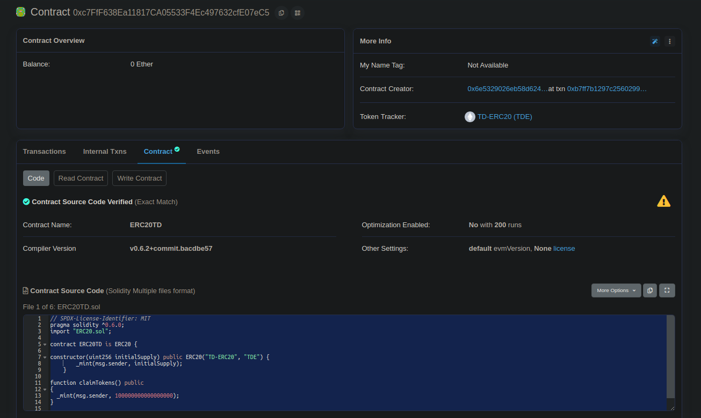
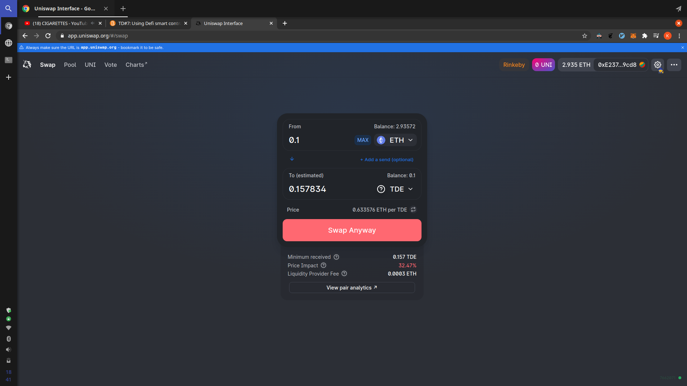
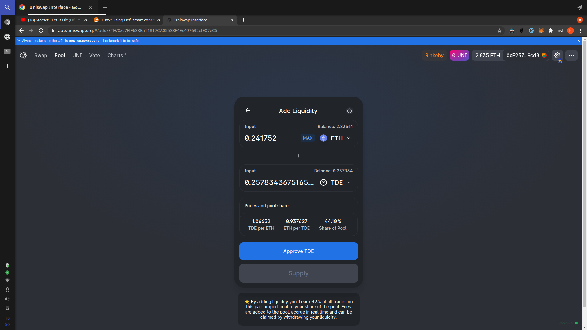
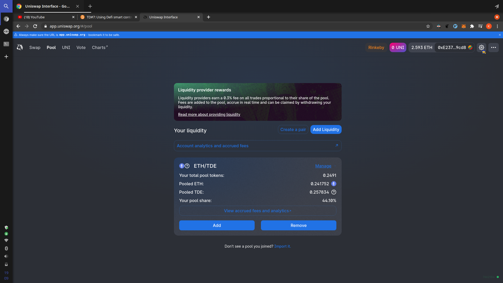
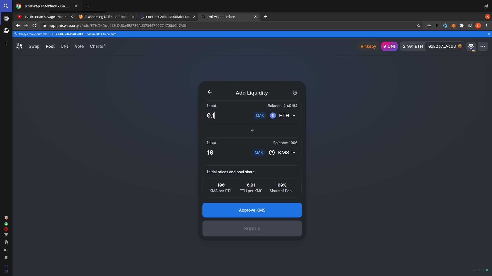

## Practical Work 7

Here are the instructions:

- Create a truffle project and configure it on Infura
- Import Uniswap and Open Zeppelin libraries
- Claim tokens from token 0xc7FfF638Ea11817CA05533F4Ec497632cfE07eC5
- Buy token 0xc7FfF638Ea11817CA05533F4Ec497632cfE07eC5 on Uniswap
- Provide liquidity to token 0xc7FfF638Ea11817CA05533F4Ec497632cfE07eC5
- Deploy an ERC20 Token (0xYYYY)
- Create a liquidity pool for your token 0xYYYY
- Create a contract (0xZZZZ) that can hold your token 0xYYYY and deposit it in the Uniswap pool
- Enable your contract 0xZZZZ to withdraw liquidity from Uniswap and return token 0xYYYY to your address
- Make it so that anyone can deposit Token 0xYYYY in your contract 0xZZZZ , supply liquidity to Uniswap, then withdraw it (keep track of balances)

### Rinkeby

The contract we have to interact with is deployed on `rinkeby` so we will need a rinkeby account for that. On the previous PW we already created one so we will use the same.

> 0xE23742d08a46d11e4e1dDf0637221a0b9C6e9cd8

Before going further, we can take a look at the content of the contract by going on the [contract](https://rinkeby.etherscan.io/address/0xc7fff638ea11817ca05533f4ec497632cfe07ec5#code) tab on etherscan. So that we can retrieve information like the contract type and the compiler version used.

<div style="display: flex; justify-content: center; align-items: center; margin: 30px 0">
  
</div>

We notice the contract inherits from an ERC20 that comes from openzeppelin. We can also notice it uses solc@0.6.0

### Infura

To interact with the contract we need to be able to talk with the blockchain. We can use [Infura](https://infura.io/) for that. Login, select **Ethereum** on the sidebar then create a project. On the **Keys** section, select `Rinkeby` and the url that looks like `https://rinkeby.infura.io/v3/<project_id>` is the url we will use.

### Truffle

Setup project.

```bash
$ yarn init -y
$ yarn add truffle @truffle/hdwallet-provider solc@0.6.2 @openzeppelin/contracts dotenv
$ ./node_modules/.bin/truffle init
```

To be able to play on Rinkeby, we need provide to truffle some information like the `account` to use to send transactions and our `infura endpoint`.

```javascript
require("dotenv").config();

const HDWalletProvider = require("@truffle/hdwallet-provider");

const private_key = process.env.PRIVATE_KEY;
const infura_endpoint = process.env.INFURA_ENDPOINT;

module.exports = {
  networks: {
    rinkeby: {
      provider: () => new HDWalletProvider(private_key, infura_endpoint),
      network_id: 4,
      gas: 5500000,
    },
  },
  compilers: {
    solc: {
      version: "0.6.2",
    },
  },
};
```

To call truffle we need to do `./node_modules/.bin/truffle`. It's kinda boring so instead we can add scripts to the `package.json`.

```json
{
  "name": "td7",
  "version": "1.0.0",
  "main": "index.js",
  "license": "MIT",
  "scripts": {
    "compile": "truffle compile",
    "develop": "truffle develop",
    "console:rinkeby": "truffle console --network rinkeby",
    "deploy:rinkeby": "truffle migrate --network rinkeby --reset"
  },
  "dependencies": {
    "@openzeppelin/contracts": "^3.3.0",
    "@truffle/hdwallet-provider": "^1.2.0",
    "dotenv": "^8.2.0",
    "solc": "0.6.2",
    "truffle": "^5.1.56"
  }
}
```

### Claim Tokens

> Instruction: Claim tokens from token 0xc7FfF638Ea11817CA05533F4Ec497632cfE07eC5

Here is the contract we have to interact with.

```javascript
// SPDX-License-Identifier: MIT
pragma solidity ^0.6.0;

import "ERC20.sol";

contract ERC20TD is ERC20 {
    constructor(uint256 initialSupply) public ERC20("TD-ERC20", "TDE") {
        _mint(msg.sender, initialSupply);
    }

    function claimTokens() public {
        _mint(msg.sender, 100000000000000000);
    }
}
```

We can use truffle to connect to rinkeby and then interact with the contract. We first need the contract abi. To do that copy the contract into `contract/ERC20TD.sol` then compile using `yarn compile`. Then go in `build/ERC20TD.json` to get the abi.

Connect to rinkeby.

```javascript
$ yarn console:rinkeby
> const me = '0xE23742d08a46d11e4e1dDf0637221a0b9C6e9cd8'
> const erc20Address = '0xc7FfF638Ea11817CA05533F4Ec497632cfE07eC5'
> const abi = [...]
> const erc20 = new web3.eth.Contract(abi, erc20Address)
> erc20.methods.claimTokens().send({ from: me })
{ blockHash:
   '0x295097a39e30284d1d0f5ffb3bb5a6b2bb6797db1113a35681d92041e369d323',
  blockNumber: 7661935,
  contractAddress: null,
  cumulativeGasUsed: 629014,
  from: '0xe23742d08a46d11e4e1ddf0637221a0b9c6e9cd8',
  gasUsed: 50177,
  logsBloom:
   '0x00000000000000000000000000000000000000000200000000000000000000000000000000000000000000000000000000000000000000000002000000000000000000000000000000000008000000000000000000000000000000000000000001000000020000000000000000000800000000000000000000000010000000000000000000000000000000000000000100000000000000000000000000000000000000000000000000000000000000000000000000000000000000000000000000000002000000000000000000000010000800000000000000000000000020000000000000000000000000000000000000000000000000000000000000000000',
  status: true,
  to: '0xc7fff638ea11817ca05533f4ec497632cfe07ec5',
  transactionHash:
   '0xfec3adb3a7d401367bc2dee00b646609d837b463fcd2f611525c8950ed14db0f',
  transactionIndex: 6,
  events:
   { Transfer:
      { address: '0xc7FfF638Ea11817CA05533F4Ec497632cfE07eC5',
        blockHash:
         '0x295097a39e30284d1d0f5ffb3bb5a6b2bb6797db1113a35681d92041e369d323',
        blockNumber: 7661935,
        logIndex: 6,
        removed: false,
        transactionHash:
         '0xfec3adb3a7d401367bc2dee00b646609d837b463fcd2f611525c8950ed14db0f',
        transactionIndex: 6,
        id: 'log_a3f561eb',
        returnValues: [Result],
        event: 'Transfer',
        signature:
         '0xddf252ad1be2c89b69c2b068fc378daa952ba7f163c4a11628f55a4df523b3ef',
        raw: [Object] } } }
```

Here's the transaction on [etherscan](https://rinkeby.etherscan.io/tx/0xfec3adb3a7d401367bc2dee00b646609d837b463fcd2f611525c8950ed14db0f)

### Buy Tokens

> Instruction: Buy token 0xc7FfF638Ea11817CA05533F4Ec497632cfE07eC5 on Uniswap

Go on [Uniswap](https://app.uniswap.org/#/swap), in the `to` field click on **Select Token** and paste the contract address `0xc7FfF638Ea11817CA05533F4Ec497632cfE07eC5`. Then enter an amount in `Ether`. In my case I get `Price impact too high` due to not enough liquidity. Since I'm on testnet I will toggle expert mode to be able to swap tokens. Then we should end up with something like this.

<div style="display: flex; justify-content: center; align-items: center; margin: 30px 0">
  
</div>

Click on **Swap anyway**.

Here is the transaction [0xecf5c61c31723ffa2dbb5c4c0d101e8f57a2b8a8f1207dc09686967018321874](https://rinkeby.etherscan.io/tx/0xecf5c61c31723ffa2dbb5c4c0d101e8f57a2b8a8f1207dc09686967018321874)

### Provide Liquidity

> Instructions: Provide liquidity to token 0xc7FfF638Ea11817CA05533F4Ec497632cfE07eC5

Go on Uniswap, in the [pool](https://app.uniswap.org/#/find) tab, join the token pool then select **TDE** token. Since we have ethers, we will provide liquidity in ethers.

<div style="display: flex; justify-content: center; align-items: center; margin: 30px 0">
  
</div>

This step is composed of 2 transactions:

- approve **TDE** contract to spend our tokens: [0x194a7985fb5f5f31f2294853941da2996ad8e56c69911e760da72ebdf7c6b947](https://rinkeby.etherscan.io/tx/0x194a7985fb5f5f31f2294853941da2996ad8e56c69911e760da72ebdf7c6b947)
- Supply the pool: [0xb39cbacb8806b2c77b6317d32dee504241baa31a3a423df3a1f2eae79560c3fd](https://rinkeby.etherscan.io/tx/0xb39cbacb8806b2c77b6317d32dee504241baa31a3a423df3a1f2eae79560c3fd)

Then we should end up with something like this

<div style="display: flex; justify-content: center; align-items: center; margin: 30px 0">
  
</div>

### Deploy ERC20

> Instruction: Deploy an ERC20 Token

```javascript
// SPDX-License-Identifier: MIT
pragma solidity ^0.6.0;

import "@openzeppelin/contracts/token/ERC20/ERC20.sol";

contract Kamas is ERC20 {
    constructor() public ERC20("Kamas", "KMS") {
        _mint(msg.sender, 1000000000000000000000);
    }

    function claimTokens() public {
        _mint(msg.sender, 1000000000);
    }
}
```

Update migrations

```javascript
const Kamas = artifacts.require("Kamas");

module.exports = (deployer) => {
  deployer.deploy(Kamas);
};
```

Deploy it

```bash
$ yarn deploy:rinkeby
```

Here is the contract address [0xDdc118cDd0a4E27E0Ad37544740C74706d6b7A0f](https://rinkeby.etherscan.io/address/0xDdc118cDd0a4E27E0Ad37544740C74706d6b7A0f)

### Liquidity

> Instructions: Create a liquidity pool for your token

We can go directly on Uniswap and create a pair. We set a ratio of 1 ETH/100 KMS.

<div style="display: flex; justify-content: center; align-items: center; margin: 30px 0">
  
</div>

Here are the 2 transations:

- approve(): [0x1b55bc3697d323948e31306fbda6a8fd263f3f4c0364cb6e0ee485ba75a32e03](https://rinkeby.etherscan.io/tx/0x1b55bc3697d323948e31306fbda6a8fd263f3f4c0364cb6e0ee485ba75a32e03)
- supply(): [0x52bb05baeafc3a372899bd92feccdd5c6805b65fd8a12f5c929a94937794b976](https://rinkeby.etherscan.io/tx/0x52bb05baeafc3a372899bd92feccdd5c6805b65fd8a12f5c929a94937794b976)

> Instructions: Create a contract (0xZZZZ) that can hold your token 0xYYYY and deposit it in the Uniswap pool

We will use Uniswap `Router` to do that. Also some contract from Uniswap require solidity compiler v0.6.6 so we need to upgrade it.

```bash
$ yarn add @uniswap/v2-core @uniswap/v2-periphery solc@0.6.6
```

Update `truffle-config.js`

```javascript
...

module.exports = {
  ...
  compilers: {
    solc: {
      version: "0.6.6",
    },
  },
};
```

Our contract should be able to hold our Kamas tokens and deposit them into the pool we created before.

To hold Kamas tokens we add a reference to our Kamas contract and add also a `deposit()` function that will transfer tokens on behalf of the caller.

> Note: Calling Kamas.approve(address(Ogrine), amount) is required before calling `deposit()`

To deposit Kamas tokens into the pool we use [Router02](https://uniswap.org/docs/v2/smart-contracts/router02/) provided by Uniswap that is deployed at `0x7a250d5630B4cF539739dF2C5dAcb4c659F2488D`. Since we created a pair KMS/ETH, the function we need is `addLiquidityETH()`. The later is marked `payable` so we can send ether to this it then we pass `msg.value` to `addLiquidityETH()`. We pass to it the Kamas contract address so that it will know which pool to send. Also, the router contract will manipulate tokens on Ogrine contract behalf so we also need to approve it via `approveRouter()` function.

```javascript
// SPDX-License-Identifier: MIT
pragma solidity ^0.6.0;

import "@uniswap/v2-periphery/contracts/interfaces/IUniswapV2Router02.sol";
import "./Kamas.sol";

contract Ogrine {
    address public constant UNISWAP_ROUTER_ADDRESS = 0x7a250d5630B4cF539739dF2C5dAcb4c659F2488D;

    IUniswapV2Router02 public router;
    Kamas public kamas;

    constructor(Kamas _kamas) public {
        router = IUniswapV2Router02(UNISWAP_ROUTER_ADDRESS);
        kamas = _kamas;
    }

    function deposit(uint256 amount) public {
        kamas.transferFrom(msg.sender, address(this), amount);
    }

    function approveRouter(uint256 amount) public {
        kamas.approve(UNISWAP_ROUTER_ADDRESS, amount);
    }

    function depositToPool(
        uint256 amountTokenDesired,
        uint256 amountTokenMin,
        uint256 amountEthMin
    ) public payable {
        // just for simplicity
        uint256 deadline = block.timestamp + 30;

        router.addLiquidityETH{ value: msg.value}(
            address(kamas),
            amountTokenDesired,
            amountTokenMin,
            amountEthMin,
            msg.sender,
            deadline
        );
    }
}
```

Deploy it

```javascript
// 2_deploy_contracts.js

// const Kamas = artifacts.require("Kamas");
const Ogrine = artifacts.require("Ogrine");

const kamasAddress = "0xDdc118cDd0a4E27E0Ad37544740C74706d6b7A0f";

module.exports = (deployer) => {
  // deployer.deploy(Kamas);
  deployer.deploy(Ogrine, kamasAddress);
};
```

```bash
$ yarn deploy:rinkeby
```

Here's the contract [0x8315758c14Cb737a8558A1f8c5B5FADe421d512E](https://rinkeby.etherscan.io/address/0x8315758c14Cb737a8558A1f8c5B5FADe421d512E)

Before depositing to the pool we should do this steps:

- kamas.approve('0x8315758c14Cb737a8558A1f8c5B5FADe421d512E', 1000) - [0x65fb48b847994b4452ae9310088a61471917a85c9b3885113772d2f48fc54f80](https://rinkeby.etherscan.io/tx/0x65fb48b847994b4452ae9310088a61471917a85c9b3885113772d2f48fc54f80)
- ogrine.deposit(1000) - [0x535a1129bcd54c47e5ed85195c9e686ea2dadef8c3a8a6b55139c6550fa41497](https://rinkeby.etherscan.io/tx/0x535a1129bcd54c47e5ed85195c9e686ea2dadef8c3a8a6b55139c6550fa41497)
- ogrine.approveRouter('0x7a250d5630B4cF539739dF2C5dAcb4c659F2488D', 1000) - [0x469e282aa6d3020ae3c6abc72de489a9f3751875175379a3992fe4296dd1e8a2](https://rinkeby.etherscan.io/tx/0x469e282aa6d3020ae3c6abc72de489a9f3751875175379a3992fe4296dd1e8a2)

We set a ratio of 100 KMS/1 ETH so we call `depositToPool()` like that:

```javascript
$ ogrine.depositToPool(100, 100, web3.utils.toWei('1', 'ether'), { value: web3.utils.toWei('1', 'ether') })
```

But the [transaction](https://rinkeby.etherscan.io/tx/0xeca97515596069df9d339a17f51e03f12da0ce1cf3af4abae2a9fbf32c743fc0) fails :( with the following error `'UniswapV2Router: INSUFFICIENT_B_AMOUNT'` triggered here

```javascript
function _addLiquidity(
    address tokenA,
    address tokenB,
    uint amountADesired,
    uint amountBDesired,
    uint amountAMin,
    uint amountBMin
) internal virtual returns (uint amountA, uint amountB) {
    // create the pair if it doesn't exist yet
    if (IUniswapV2Factory(factory).getPair(tokenA, tokenB) == address(0)) {
        IUniswapV2Factory(factory).createPair(tokenA, tokenB);
    }
    (uint reserveA, uint reserveB) = UniswapV2Library.getReserves(factory, tokenA, tokenB);
    if (reserveA == 0 && reserveB == 0) {
        (amountA, amountB) = (amountADesired, amountBDesired);
    } else {
        uint amountBOptimal = UniswapV2Library.quote(amountADesired, reserveA, reserveB);
        if (amountBOptimal <= amountBDesired) {
            require(amountBOptimal >= amountBMin, 'UniswapV2Router: INSUFFICIENT_B_AMOUNT');
            (amountA, amountB) = (amountADesired, amountBOptimal);
        } else {
            uint amountAOptimal = UniswapV2Library.quote(amountBDesired, reserveB, reserveA);
            assert(amountAOptimal <= amountADesired);
            require(amountAOptimal >= amountAMin, 'UniswapV2Router: INSUFFICIENT_A_AMOUNT');
            (amountA, amountB) = (amountAOptimal, amountBDesired);
        }
    }
}
```

Unfortunately, I don't know and don't have time to debug it.

> Instruction: Enable your contract 0xZZZZ to withdraw liquidity from Uniswap and return token 0xYYYY to your address

Since the previous step didn't work, this one will not too.

But I think we should use `removeLiquidityETH()` from `router` to do that.

```javascript
// contracts/Ogrine.sol
function withdrawFromPool(
    uint256 liquidity,
    uint256 amountTokenMin,
    uint256 amountEthMin
) public {
    // just for simplicity
    uint256 deadline = block.timestamp + 30;

    router.removeLiquidityETH(
        address(kamas),
        liquidity,
        amountTokenMin,
        amountEthMin,
        msg.sender,
        deadline
    );
}
```

It would be nice to have a feedback regarding what I did :)

> Instructions: Make it so that anyone can deposit Token 0xYYYY in your contract 0xZZZZ , supply liquidity to Uniswap, then withdraw it (keep track of balances)

The Ogrine contract already allows everyone to deposit Kamas tokens in it. They just need to call `claimTokens()` and call `approve(Ogrine.address, amount)` from Kamas contract.

Regarding supplying/withdrawing liquidity, like said previously, I have an issue when providing liquidity. I don't know if this is related to the contracts or something else I misunderstood like the process to use correctly `UniswapV2Router02`. But if we assume there is no issue then people can deposit and withdraw liquidity.

Concerning the 'keep track of balances', what I understand is that we should keep track of `KMS` and `ETH` deposits. Since the amounts we want to deposit are not guaranteed to be exact, I don't actually know how to handle the difference between what we want to deposit and what is actually deposited.

```javascript
// SPDX-License-Identifier: MIT
pragma solidity ^0.6.0;

import "@uniswap/v2-periphery/contracts/interfaces/IUniswapV2Router02.sol";
import "./Kamas.sol";

contract Ogrine {
    address public constant UNISWAP_ROUTER_ADDRESS = 0x7a250d5630B4cF539739dF2C5dAcb4c659F2488D;

    mapping(address => uint256) public accountToDepositedKamas;
    mapping(address => uint256) public accountToDepositedETH;

    IUniswapV2Router02 public router;
    Kamas public kamas;

    constructor(Kamas _kamas) public {
        router = IUniswapV2Router02(UNISWAP_ROUTER_ADDRESS);
        kamas = _kamas;
    }

    function deposit(uint256 amount) public {
        kamas.transferFrom(msg.sender, address(this), amount);
    }

    function approveRouter(uint256 amount) public {
        kamas.approve(UNISWAP_ROUTER_ADDRESS, amount);
    }

    function depositToPool(
        uint256 amountTokenDesired,
        uint256 amountTokenMin,
        uint256 amountEthMin
    ) public payable {
        // what happens when amount deposited < amountTokenDesired?
        accountToDepositedKamas[msg.sender] += amountTokenDesired;
        // what happens when amount deposited < msg.value?
        accountToDepositedETH[msg.sender] += msg.value;

        // just for simplicity
        uint256 deadline = block.timestamp + 30;

        router.addLiquidityETH{ value: msg.value}(
            address(kamas),
            amountTokenDesired,
            amountTokenMin,
            amountEthMin,
            msg.sender,
            deadline
        );
    }

    function withdrawFromPool(
        uint256 liquidity,
        uint256 amountTokenMin,
        uint256 amountEthMin
    ) public {
        // what happens when amount withdrew < liquidity?
        accountToDepositedKamas[msg.sender] -= liquidity;
        // what happens when amount withdrew > amountEthMin?
        accountToDepositedETH[msg.sender] -= amountEthMin;

        // just for simplicity
        uint256 deadline = block.timestamp + 30;

        router.removeLiquidityETH(
            address(kamas),
            liquidity,
            amountTokenMin,
            amountEthMin,
            msg.sender,
            deadline
        );
    }
}
```
